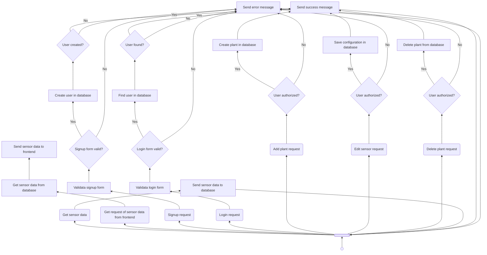

```mermaid
flowchart BT;
	Start@{ shape: start }
	Start --> MainFork
	
	MainFork@{ shape: fork }
	MainFork --> GetSensorData
	MainFork --> GetRequestOfSensorDataFromFrontend
	MainFork --> SignupRequest
	MainFork --> LoginRequest
	MainFork --> AddPlantRequest
	MainFork --> EditSensorRequest
	MainFork --> DeletePlantRequest

	GetSensorData@{ shape: event, label: "Get sensor data" }
	GetSensorData --> SendSensorDataToDB

	SendSensorDataToDB@{ shape: process, label: "Send sensor data to database" }
	SendSensorDataToDB --> MainFork

	GetRequestOfSensorDataFromFrontend@{ shape: event, label: "Get request of sensor data from frontend" }
	GetRequestOfSensorDataFromFrontend --> GetSensorDataFromDB

	GetSensorDataFromDB@{ shape: process, label: "Get sensor data from database" }
	GetSensorDataFromDB --> SendSensorDataToFrontend

	SendSensorDataToFrontend@{ shape: process, label: "Send sensor data to frontend" }

	SignupRequest@{ shape: event, label: "Signup request" }
	SignupRequest --> ValidateSignupForm

	ValidateSignupForm@{ shape: process, label: "Validata signup form" }
	ValidateSignupForm --> SignupFormValid

	SignupFormValid@{ shape: decision, label: "Signup form valid?" }
	SignupFormValid -- Yes --> CreateUserInDatabase
	SignupFormValid -- No --> SendErrorMessage

	CreateUserInDatabase@{ shape: process, label: "Create user in database" }
	CreateUserInDatabase --> UserCreated

	UserCreated@{ shape: decision, label: "User created?" }
	UserCreated -- Yes --> SendSuccessMessage
	UserCreated -- No --> SendErrorMessage

	SendErrorMessage@{ shape: process, label: "Send error message" }
	SendErrorMessage --> MainFork

	SendSuccessMessage@{ shape: process, label: "Send success message" }
	SendSuccessMessage --> MainFork

	LoginRequest@{ shape: event, label: "Login request" }
	LoginRequest --> ValidateLoginForm

	ValidateLoginForm@{ shape: process, label: "Validata login form" }
	ValidateLoginForm --> LoginFormValid

	LoginFormValid@{ shape: decision, label: "Login form valid?" }
	LoginFormValid -- Yes --> FindUserInDatabase
	LoginFormValid -- No --> SendErrorMessage

	FindUserInDatabase@{ shape: process, label: "Find user in database" }
	FindUserInDatabase --> UserFound

	UserFound@{ shape: decision, label: "User found?" }
	UserFound -- Yes --> SendSuccessMessage
	UserFound -- No --> SendErrorMessage

	AddPlantRequest@{ shape: event, label: "Add plant request" }
	AddPlantRequest --> UserAuthorized

	UserAuthorized@{ shape: decision, label: "User authorized?" }
	UserAuthorized -- Yes --> CreatePlantInDB
	UserAuthorized -- No --> SendErrorMessage

	CreatePlantInDB@{ shape: process, label: "Create plant in database" }
	CreatePlantInDB --> SendSuccessMessage

	EditSensorRequest@{ shape: event, label: "Edit sensor request" }
	EditSensorRequest --> UserAuthorized2

	UserAuthorized2@{ shape: decision, label: "User authorized?" }
	UserAuthorized2 -- Yes --> SaveConfigInDB
	UserAuthorized2 -- No --> SendErrorMessage

	SaveConfigInDB@{ shape: process, label: "Save configuration in database" }
	SaveConfigInDB --> SendSuccessMessage

	DeletePlantRequest@{ shape: event, label: "Delete plant request" }
	DeletePlantRequest --> UserAuthorized3

	UserAuthorized3@{ shape: decision, label: "User authorized?" }
	UserAuthorized3 -- Yes --> DeletePlantFromDB
	UserAuthorized3 -- No --> SendErrorMessage

	DeletePlantFromDB@{ shape: process, label: "Delete plant from database" }
	DeletePlantFromDB --> SendSuccessMessage
```