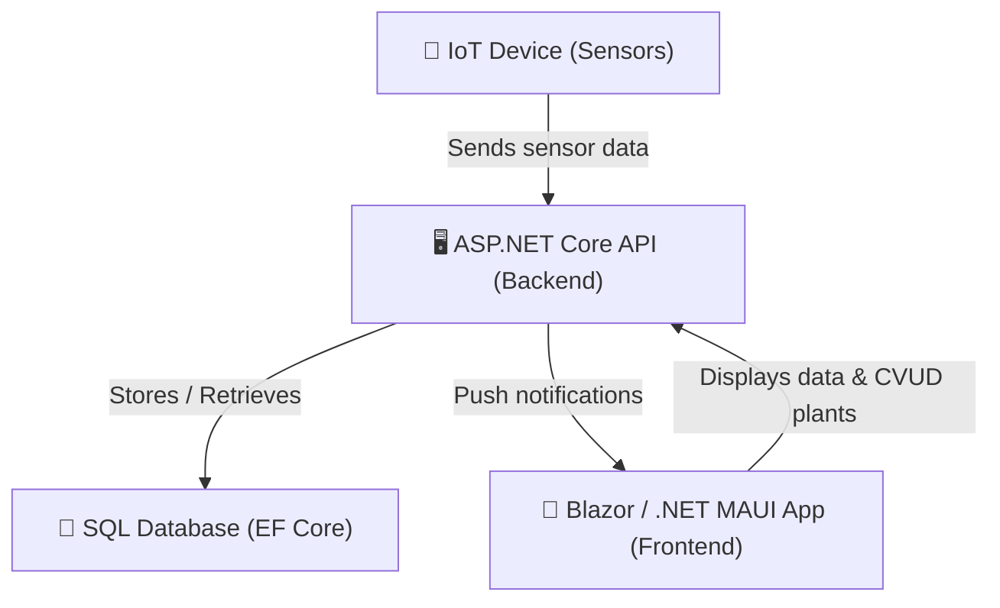

# 🌿 Plant Monitoring System — Functional Requirements Document (FRD)

## 1. Introduction

The **Plant Monitoring System** is an educational IoT-based project designed to help users monitor the condition of their indoor plants.  
It is intended for both users who have difficulties caring for their plants and those who want to precisely track environmental parameters such as temperature, humidity, and light intensity.

### 1.1. Goals and Objectives

- Enable **real-time monitoring** of plant conditions using IoT sensors.  
- Provide **push notifications** when user attention is required (e.g., dry soil, low light).  
- Allow users to **Create / View / Update / Delete (CVUD)** plant profiles and associated configurations.  
- Ensure **cross-platform access** through Blazor (web) and .NET MAUI (mobile) applications.

### 1.2. Terms and Acronyms

| Term/Acronym | Definition | Description |
|---------------|-------------|--------------|
| **CVUD** | Create / View / Update / Delete | Equivalent to CRUD operations |
| **IoT** | Internet of Things | Network of connected devices (sensors) |
| **MAUI** | Multi-platform App UI | .NET cross-platform framework for mobile and desktop apps |
| **EF Core** | Entity Framework Core | Object-relational mapper for .NET |
| **API** | Application Programming Interface | Interface between system components |

### 1.3. References

- [.NET Documentation](https://learn.microsoft.com/dotnet/)  
- [nanoFramework](https://www.nanoframework.net/)  
- [Entity Framework Core](https://learn.microsoft.com/ef/core/)  
- [Blazor Documentation](https://learn.microsoft.com/aspnet/core/blazor/)

---

## 2. System Overview

All components in this solution are built on the **.NET technology stack**, ensuring consistent development and integration.

- **IoT Layer:** nanoFramework running on ESP32/STM32 microcontrollers with sensors for temperature, humidity, and light.  
- **Backend Layer:** ASP.NET Core Web API for data handling, authentication, and logic.  
- **Database Layer:** EF Core + SQL Server (or SQLite) for data persistence.  
- **Frontend Layer:** Blazor (web) and .NET MAUI (mobile) applications for user interaction.

### 2.1. System Diagram

### 2.2. System Actors

| Actor | Description | Frequency | Access / Features |
|--------|--------------|------------|-------------------|
| **User (Plant Owner)** | Monitors data, manages plant profiles, receives notifications | Daily | Login / Signup, CVUD plants, view sensor data |
| **IoT Device** | Collects and sends sensor data to backend | Periodic | Authenticated device key, one-way data flow |

---

## 3. Functional Requirements

| № | Function | Description / Rules / Dependencies |
|----|-----------|-----------------------------------|
| 1 | **User Registration & Login** | Users register and authenticate via secure JWT tokens. |
| 2 | **CVUD Plant Profiles** | Each user can add, view, modify, or delete multiple plant records. |
| 3 | **Configure Sensors** | IoT device linked to a plant; configuration can be updated remotely. |
| 4 | **Receive Push Notifications** | Sent when parameters (humidity, temperature, light) deviate from target range. |
| 5 | **View Real-Time Data** | Frontend retrieves latest sensor data from backend (polling or SignalR). |
| 6 | **Historical Data Storage** | All readings stored in the database for analytics and trends. |
| 7 | **Responsive UI** | Interface adapts to different screen sizes and platforms. |

---

## 4. Non-Functional Requirements

| Category | Requirement |
|-----------|--------------|
| **Performance** | The system should handle up to 100 sensor updates per minute. |
| **Reliability** | Data loss tolerance below 1%; automatic retry for failed sensor uploads. |
| **Scalability** | Architecture allows adding more sensors or users easily. |
| **Security** | Use JWT authentication and HTTPS communication. |
| **Usability** | Intuitive interface suitable for non-technical users. |
| **Maintainability** | Layered architecture with clear separation of concerns. |
| **Portability** | Runs on web (Blazor) and mobile (MAUI) platforms. |

---

## 5. Data Model (Conceptual)

| Entity | Key Attributes | Description |
|---------|----------------|-------------|
| **User** | Id, Name, Email, PasswordHash | Registered user of the system |
| **Plant** | Id, Name, Species, OwnerId, OptimalTemp, OptimalHumidity | Represents a specific plant |
| **Sensor** | Id, Type, PlantId, Config | IoT sensor linked to a plant |
| **SensorData** | Id, SensorId, Timestamp, Value | Logged sensor reading |
| **Notification** | Id, PlantId, Type, Message, Timestamp | System alert sent to the user |

---

## 6. Future Enhancements

- Add integration with **automated watering system**.  
- Apply **machine learning** to predict plant health.  
- Include **graphical data dashboards** for visualization.  