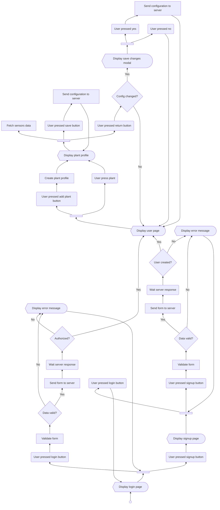

```mermaid
flowchart BT;
	Start@{ shape: start } --> DisplayLoginPage@{ shape: display, label: "Display login page" }
	DisplayLoginPage --> LoginPageFork@{ shape: fork }
		LoginPageFork --> UserPressedLogin@{ shape: event, label: "User pressed login button" }
		UserPressedLogin --> ValidateForm@{ shape: process, label: "Validate form" }
		ValidateForm --> DataValid@{ shape: decision, label: "Data valid?" }
			DataValid -- Yes --> SendForm@{ shape: process, label: "Send form to server" }
			SendForm --> WaitServerResponse@{ shape: event, label: "Wait server response" }
			WaitServerResponse --> Authorized@{ shape: decision, label: "Authorized?" }
				Authorized -- Yes --> DisplayUserPage@{ shape: display, label: "Display user page" }
				DisplayUserPage --> UserPageFork@{ shape: fork }
					UserPageFork --> AddPlantButton@{ shape: event, label: "User pressed add plant button" }
					AddPlantButton --> AddPlant@{ shape: process, label: "Create plant profile" }
					AddPlant --> DisplayPlant@{ shape: display, label: "Display plant profile" }
					DisplayPlant --> DisplayPlantFork@{ shape: fork }
						DisplayPlantFork --> FetchSensorData@{ shape: process, label: "Fetch sensors data" }			
						
						DisplayPlantFork --> UserPressedSave@{ shape: event, label: "User pressed save button" }
						UserPressedSave --> SendConfig@{ shape: process, label: "Send configuration to server" }
						SendConfig --> DisplayPlant

						DisplayPlantFork --> UserPressedReturn@{ shape: event, label: "User pressed return button" }
						UserPressedReturn --> ConfigChanged@{ shape: decision, label: "Config changed?" }
							ConfigChanged -- Yes --> DisplaySaveChanges@{ shape: display,  label: "Display save changes modal" }
							DisplaySaveChanges --> SaveChangesFork@{ shape: fork }
								SaveChangesFork --> UserPressedYes@{ shape: event, label: "User pressed yes" }
								UserPressedYes --> SendConfig2@{ shape: process, label: "Send configuration to server" }
								SendConfig2 --> DisplayUserPage

								SaveChangesFork --> UserPressedNo@{ shape: event, label: "User pressed no" }
								UserPressedNo --> DisplayUserPage

							ConfigChanged -- No --> DisplayUserPage
					
					UserPageFork --> PlantPressed@{ shape: event, label: "User press plant" }
					PlantPressed --> DisplayPlant

				Authorized -- No --> ErrorMessage@{ shape: display, label: "Display error message" }

			DataValid -- No --> ErrorMessage@{ shape: display, label: "Display error message" }
			ErrorMessage --> LoginPageFork

		LoginPageFork --> UserPressedSignup@{ shape: event, label: "User pressed signup button" }
		UserPressedSignup --> DisplaySignupPage@{shape: display, label: "Display signup page" }
		DisplaySignupPage --> SignupPageFork@{ shape: fork }
			SignupPageFork --> UserPressedSignup2@{ shape: event, label: "User pressed signup button" }
			UserPressedSignup2 --> ValidateForm2@{ shape: process, label: "Validate form" }
			ValidateForm2 --> DataValid2@{ shape: decision, label: "Data valid?" }
				DataValid2 -- Yes --> SendForm2@{ shape: process, label: "Send form to server" }
				SendForm2 --> WaitServerResponse2@{ shape: event, label: "Wait server response" }
				WaitServerResponse2 --> UserCreated@{ shape: decision, label: "User created?" }
					UserCreated -- Yes --> DisplayUserPage
					UserCreated -- No --> ErrorMessage2

				DataValid2 -- No --> ErrorMessage2@{ shape: display, label: "Display error message" }
				ErrorMessage2 --> SignupPageFork

			SignupPageFork --> UserPressedLogin2@{ shape: event, label: "User pressed login button" }
			UserPressedLogin2 --> DisplayLoginPage
```