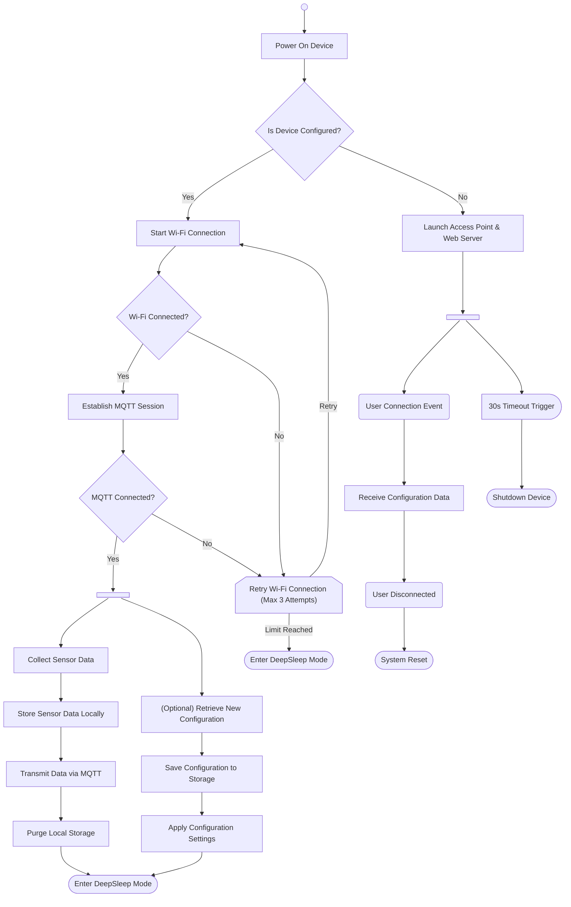

```mermaid
flowchart TD
    A@{shape: start} --> B@{shape: process, label: "Power On Device"}
    B --> C@{shape: decision, label: "Is Device Configured?"}

    C -->|Yes| D@{shape: process, label: "Start Wi-Fi Connection"}
    C -->|No| N@{shape: process, label: "Launch Access Point & Web Server"}

    D --> E@{shape: decision, label: "Wi-Fi Connected?"}
    E -->|Yes| F@{shape: process, label: "Establish MQTT Session"}
    E -->|No| R@{shape: loop-limit, label: "Retry Wi-Fi Connection (Max 3 Attempts)"}

    R -->|Limit Reached| DS1@{shape: terminal, label: "Enter DeepSleep Mode"}
    R -->|Retry| D

    F --> G@{shape: decision, label: "MQTT Connected?"}
    G -->|Yes| H@{shape: fork, label: "Parallel Async Operations"}
    G -->|No| R

    %% Async fork branches
    H --> I@{shape: process, label: "Collect Sensor Data"}
    I --> J@{shape: process, label: "Store Sensor Data Locally"}
    J --> K@{shape: process, label: "Transmit Data via MQTT"}
    K --> L@{shape: process, label: "Purge Local Storage"}
    L --> M@{shape: terminal, label: "Enter DeepSleep Mode"}

    H --> O@{shape: process, label: "(Optional) Retrieve New Configuration"}
    O --> P@{shape: process, label: "Save Configuration to Storage"}
    P --> Q@{shape: process, label: "Apply Configuration Settings"}
    Q --> M

    %% Unconfigured device branch with event/delay fork
    N --> H1@{shape: fork, label: "Wait for Event or Timeout"}
    H1 --> E1@{shape: event, label: "User Connection Event"}
    H1 --> D1@{shape: delay, label: "30s Timeout Trigger"}

    E1 --> U@{shape: process, label: "Receive Configuration Data"}
    D1 --> V@{shape: terminal, label: "Shutdown Device"}

    U --> W@{shape: event, label: "User Disconnected"}
    W --> X@{shape: terminal, label: "System Reset"}
```