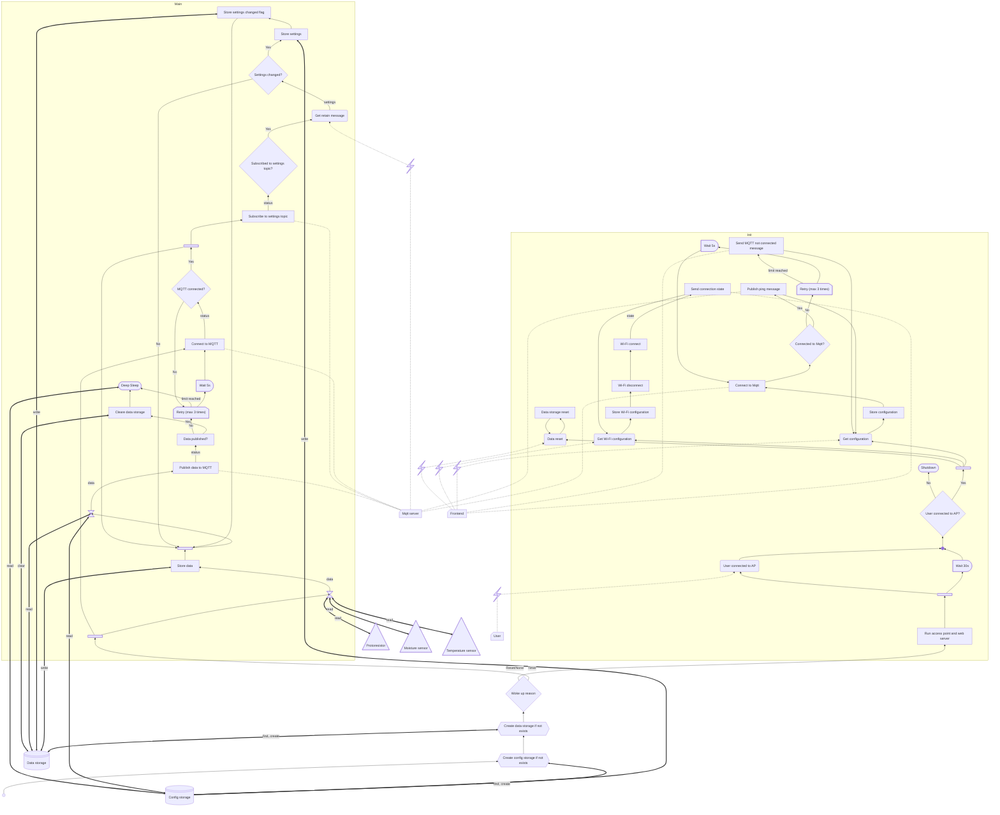

```mermaid
flowchart BT
    IoT_Photoresistor@{ shape: extract, label: "Protoresistor" }
    IoT_Photoresistor <== read ==> IoT_GatherData

    IoT_Moisture@{ shape: extract, label: "Moisture sensor" }
    IoT_Moisture <== read ==> IoT_GatherData
       
    IoT_Temperature@{ shape: extract, label: "Temperature sensor" }
    IoT_Temperature <== read ==> IoT_GatherData

    IoT_ConfigStorage@{ shape: disk, label: "Config storage" }
    IoT_ConfigStorage <== find, create ==> IoT_CreateConfigStorage
    IoT_ConfigStorage <== write ==> IoT_StoreSettings
    IoT_ConfigStorage <== read ==> IoT_GetPublishData
    IoT_ConfigStorage <== read ==> IoT_DeepSleep

    IoT_DataStorage@{ shape: disk, label: "Data storage" }
    IoT_DataStorage <== find, create ==> IoT_CreateDataStorage
    IoT_DataStorage <== write ==> IoT_StoreData
    IoT_DataStorage <== write ==> IoT_StoreSettingsChangedFlag
    IoT_DataStorage <== read ==> IoT_GetPublishData
    IoT_DataStorage <== clear ==> IoT_ClearDataStorage

    IoT_MqttServer@{ shape: card, label: "Mqtt server" }
    IoT_MqttServer -.- IoT_ConnectMqtt
    IoT_MqttServer -.- IoT_SubSettingsTopic
    IoT_MqttServer -.- IoT_SendingRetainMessage@{ shape: com-link } -.-> IoT_GetRetainMessage 
    IoT_MqttServer -.- IoT_PublishData
    IoT_MqttServer -.- IoT_ConnectToMqtt
    IoT_MqttServer -.- IoT_PublishPingMessage

    IoT_User@{ shape: card, label: "User" }
    IoT_User -.- IoT_UserConnectToAP@{ shape: com-link } -.-> IoT_UserConnected

    IoT_Frontend@{ shape: card, label: "Frontend" }
    IoT_Frontend -.- IoT_FrontendSendConf@{ shape: com-link } -.-> IoT_GetConf
    IoT_Frontend -.- IoT_FrontendSendWiFiConf@{ shape: com-link } -.-> IoT_GetWifiConf
    IoT_Frontend -.- IoT_FrontendSendDataReset@{ shape: com-link } -.-> IoT_DataStorageResetEvent
    IoT_Frontend -.- IoT_SendConnectionState
    IoT_Frontend -.- IoT_SendMqttNotConnectedMessage

    IoT_Start@{ shape: start }
    IoT_Start --> IoT_CreateConfigStorage

    IoT_CreateConfigStorage@{ shape: prepare, label: "Create config storage if not exists" }
    IoT_CreateConfigStorage --> IoT_CreateDataStorage

    IoT_CreateDataStorage@{ shape: prepare, label: "Create data storage if not exists" }
    IoT_CreateDataStorage --> IoT_WokeUpReason

    IoT_WokeUpReason@{ shape: decision, label: "Woke up reason" }
    IoT_WokeUpReason -- Timer --> IoT_MainFork
    IoT_WokeUpReason -- Reset/None --> IoT_RunAcessPointAndWebServer

    subgraph Main
        IoT_MainFork@{ shape: fork }
        IoT_MainFork --> IoT_GatherData
        IoT_MainFork --> IoT_ConnectMqtt

        IoT_GatherData@{ shape: collate }
        IoT_GatherData -- data --> IoT_StoreData

        IoT_StoreData@{ shape: process, label: "Store data" }
        IoT_StoreData --> IoT_GetPublishDataSync

        IoT_ConnectMqtt@{ shape: process, label: "Connect to MQTT" }
        IoT_ConnectMqtt -- status --> IoT_MqttConnected?

        IoT_MqttConnected?@{ shape: decision, label: "MQTT connected?" }
        IoT_MqttConnected? -- Yes --> IoT_MqttFork
        IoT_MqttConnected? -- No --> IoT_RetryConnectMqtt

        IoT_MqttFork@{ shape: fork }
        IoT_MqttFork --> IoT_SubSettingsTopic
        IoT_MqttFork --> IoT_GetPublishDataSync

        IoT_SubSettingsTopic@{ shape: process, label: "Subscribe to settings topic" }
        IoT_SubSettingsTopic -- status --> IoT_SettingsTopicSubed?
        
        IoT_SettingsTopicSubed?@{ shape: decision, label: "Subscribed to settings topic?" }
        IoT_SettingsTopicSubed? -- Yes --> IoT_GetRetainMessage
        
        IoT_GetRetainMessage@{ shape: event, label: "Get retain message" }
        IoT_GetRetainMessage -- settings --> IoT_SettingsChanged?

        IoT_SettingsChanged?@{ shape: decision, label: "Settings changed?" }
        IoT_SettingsChanged? -- Yes --> IoT_StoreSettings
        IoT_SettingsChanged? -- No --> IoT_GetPublishDataSync

        IoT_StoreSettings@{ shape: process, label: "Store settings" }
        IoT_StoreSettings --> IoT_StoreSettingsChangedFlag

        IoT_StoreSettingsChangedFlag@{ shape: process, label: "Store settings changed flag" }
        IoT_StoreSettingsChangedFlag --> IoT_GetPublishDataSync

        IoT_GetPublishDataSync@{ shape: fork }
        IoT_GetPublishDataSync --> IoT_GetPublishData

        IoT_GetPublishData@{ shape: collate }
        IoT_GetPublishData -- data --> IoT_PublishData

        IoT_PublishData@{ shape: process, label: "Publish data to MQTT" }
        IoT_PublishData -- status --> IoT_DataPublished?

        IoT_DataPublished?@{ status: decision, label: "Data published?"}
        IoT_DataPublished? -- Yes --> IoT_ClearDataStorage
        IoT_DataPublished? -- No --> IoT_RetryConnectMqtt

        IoT_ClearDataStorage@{ shape: process, label: "Cleare data storage" }
        IoT_ClearDataStorage --> IoT_DeepSleep

        IoT_DeepSleep@{ shape: terminal, label: "Deep Sleep" }

        IoT_RetryConnectMqtt@{ shape: loop-limit, label: "Retry (max 3 times)"}
        IoT_RetryConnectMqtt --> IoT_RetryConnectMqttDelay
        IoT_RetryConnectMqtt -- limit reached --> IoT_DeepSleep

        IoT_RetryConnectMqttDelay@{ shape: delay, label: "Wait 5s" }
        IoT_RetryConnectMqttDelay --> IoT_ConnectMqtt
    end
    subgraph Init
        IoT_RunAcessPointAndWebServer@{ shape: process, label: "Run access point and web server" }
        IoT_RunAcessPointAndWebServer --> IoT_ConnectionFork

        IoT_ConnectionFork@{ shape: fork }
        IoT_ConnectionFork --> IoT_UserConnectTimeout
        IoT_ConnectionFork --> IoT_UserConnected

        IoT_UserConnectTimeout@{ shape: delay, label: "Wait 30s" }
        IoT_UserConnectTimeout --> IoT_WebServerJunc

        IoT_UserConnected@{ shape: event, label: "User connected to AP" }
        IoT_UserConnected --> IoT_WebServerJunc

        IoT_WebServerJunc@{ shape: junction }
        IoT_WebServerJunc --> IoT_UserConnected?

        IoT_UserConnected?@{ shape: decision, label: "User connected to AP?" }
        IoT_UserConnected? -- Yes --> IoT_WebServerFork
        IoT_UserConnected? -- No --> IoT_Shutdown

        IoT_Shutdown@{ shape: terminal, label: "Shutdown" }

        IoT_WebServerFork@{ shape: fork }
        IoT_WebServerFork --> IoT_GetConf
        IoT_WebServerFork --> IoT_GetWifiConf
        IoT_WebServerFork --> IoT_DataStorageResetEvent

        IoT_GetConf@{ shape: event, label: "Get configuration" }
        IoT_GetConf --> IoT_StoreConf

        IoT_StoreConf@{ shape: process, label: "Store configuration" }
        IoT_StoreConf --> IoT_ConnectToMqtt

        IoT_ConnectToMqtt@{ shape: process, label: "Connect to Mqtt" }
        IoT_ConnectToMqtt --> IoT_ConnectedToMqtt?

        IoT_ConnectedToMqtt?@{ shape: decision, label: "Connected to Mqtt?" }
        IoT_ConnectedToMqtt? -- Yes --> IoT_PublishPingMessage
        IoT_ConnectedToMqtt? -- No --> IoT_RetryMqtt

        IoT_RetryMqtt@{ shape: loop-limit, label: "Retry (max 3 times)" }
        IoT_RetryMqtt --> IoT_RetryDelay
        IoT_RetryMqtt -- limit reached --> IoT_SendMqttNotConnectedMessage

        IoT_SendMqttNotConnectedMessage@{ shape: process, label: "Send MQTT not connected message"}
        IoT_SendMqttNotConnectedMessage --> IoT_GetConf

        IoT_RetryDelay@{ shape: delay, label: "Wait 5s" }
        IoT_RetryDelay --> IoT_ConnectToMqtt

        IoT_PublishPingMessage@{ shape: process, label: "Publish ping message" }
        IoT_PublishPingMessage --> IoT_GetConf

        IoT_GetWifiConf@{ shape: event, label: "Get Wi-Fi configuration" }
        IoT_GetWifiConf --> IoT_StoreWiFiConf

        IoT_StoreWiFiConf@{ shape: process, label: "Store Wi-Fi configuration" }
        IoT_StoreWiFiConf --> IoT_WiFiDisconnect

        IoT_WiFiDisconnect@{ shape: process, label: "Wi-Fi disconnect" }
        IoT_WiFiDisconnect --> IoT_WiFiConnect

        IoT_WiFiConnect@{ shape: process, label: "Wi-Fi connect" }
        IoT_WiFiConnect -- state --> IoT_SendConnectionState

        IoT_SendConnectionState@{ shape: process, label: "Send connection state" }
        IoT_SendConnectionState --> IoT_GetWifiConf

        IoT_DataStorageResetEvent@{ shape: event, label: "Data reset" }
        IoT_DataStorageResetEvent --> IoT_DataStorageReset

        IoT_DataStorageReset@{ shape: process, label: "Data storage reset" }
        IoT_DataStorageReset --> IoT_DataStorageResetEvent
    end
```