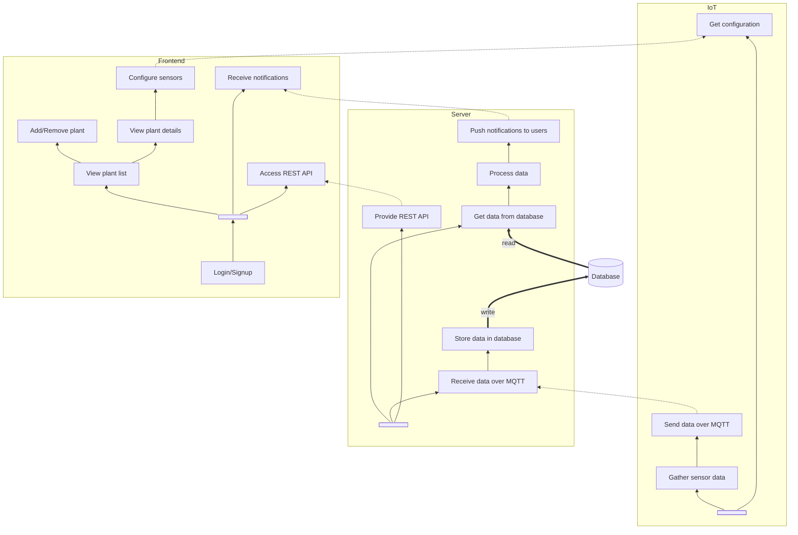

```mermaid
flowchart BT;
	Database@{ shape: database, label: "Database" }
	Server_StoreData == write ==> Database
	Database == read ==> Server_GetData

	subgraph IoT
		IoT_Fork@{ shape: fork }
		IoT_Fork --> IoT_Configuration
		IoT_Fork --> IoT_GatherData

		IoT_Configuration@{ shape: process, label: "Get configuration" }

		IoT_GatherData@{ shape: process, label: "Gather sensor data" }
		IoT_GatherData --> IoT_SendData

		IoT_SendData@{ shape: process, label: "Send data over MQTT" }
	end

	subgraph Server
		Server_Fork@{ shape: fork }
		Server_Fork --> Server_ProvideAPI
		Server_Fork --> Server_ReceiveData
		Server_Fork --> Server_GetData

		Server_ReceiveData@{ shape: process, label: "Receive data over MQTT" }
		Server_ReceiveData --> Server_StoreData
		IoT_SendData -.-> Server_ReceiveData

		Server_StoreData@{ shape: process, label: "Store data in database" }

		Server_GetData@{ shape: process, label: "Get data from database" }
		Server_GetData --> Server_ProcessData

		Server_ProcessData@{ shape: process, label: "Process data" }
		Server_ProcessData --> Server_PushNotifications

		Server_ProvideAPI@{ shape: process, label: "Provide REST API" }

		Server_PushNotifications@{ shape: process, label: "Push notifications to users" }
	end

	subgraph Frontend
		Frontend_LoginSignup@{ shape: process, label: "Login/Signup" }
		Frontend_LoginSignup --> Frontend_Fork

		Frontend_Fork@{ shape: fork }
		Frontend_Fork --> Frontend_AccessAPI
		Frontend_Fork --> Frontend_ReceiveNotifications
		Frontend_Fork --> Frontend_ViewPlantList

		Frontend_AccessAPI@{ shape: process, label: "Access REST API" }	
		Server_ProvideAPI -.-> Frontend_AccessAPI

		Frontend_ReceiveNotifications@{ shape: process, label: "Receive notifications" }

		Server_PushNotifications -.-> Frontend_ReceiveNotifications

		Frontend_ViewPlantList@{ shape: process, label: "View plant list" }
		Frontend_ViewPlantList --> Frontend_ViewPlantDetails
		Frontend_ViewPlantList --> Frontend_AddRemovePlant

		Frontend_AddRemovePlant@{ shape: process, label: "Add/Remove plant" }

		Frontend_ViewPlantDetails@{ shape: process, label: "View plant details" }
		Frontend_ViewPlantDetails --> Frontend_ConfigureSensors

		Frontend_ConfigureSensors@{ shape: process, label: "Configure sensors" }
		Frontend_ConfigureSensors -.-> IoT_Configuration
	end
```