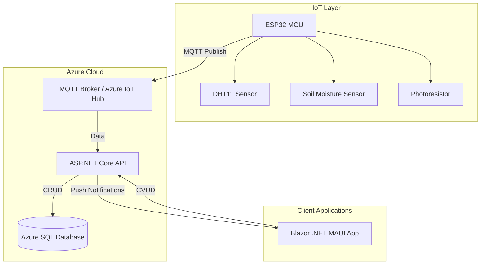
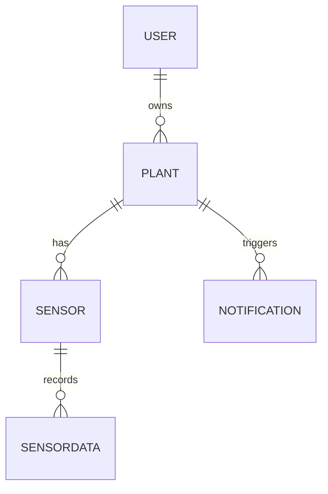
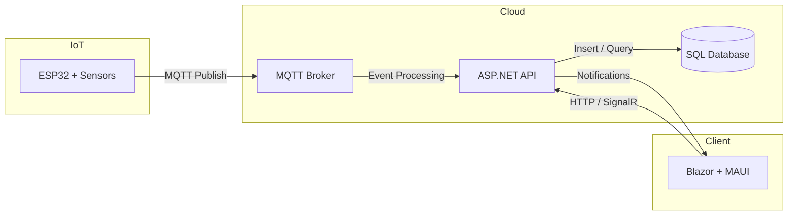

# 🛠️ Plant Monitoring System — Technical Design Document (TDD)

## 1. Introduction

This document describes the **technical design and architecture** of the Plant Monitoring System, which enables users to monitor the environmental conditions of their indoor plants through IoT devices, a web interface, and mobile applications.

### 1.1. Purpose
The goal of this document is to define **how** the system will be implemented, including hardware/software components, data flows, APIs, databases, and deployment environments.

### 1.2. Related Documents
- [Functional Requirements Document (FRD)](./FRD.md)

### 1.3. Scope
The system consists of:
- **IoT Layer:** ESP32 with soil moisture, DHT11 (temperature/humidity), and photoresistor sensors.
- **Backend:** ASP.NET Core Web API handling MQTT messages and providing data to clients.
- **Frontend:** Blazor .NET MAUI application for monitoring and management.
- **Database:** Azure SQL Database managed via Entity Framework Core.
- **Messaging:** MQTT protocol for IoT → Backend communication.

---

## 2. System Architecture Overview

### 2.1. Technology Stack
| Layer | Technology |
|--------|-------------|
| **IoT** | ESP32 + nanoFramework, MQTT |
| **Backend** | ASP.NET Core 9, MQTT Broker (Mosquitto or Azure IoT Hub), SignalR, EF Core |
| **Database** | Azure SQL Database |
| **Frontend** | Blazor .NET MAUI (C#) |
| **Deployment** | Azure App Service, Azure IoT Hub, Azure SQL |

### 2.2. High-Level Architecture Diagram


---

## 3. Component Design

| Component | Description | Technology | Key Interfaces |
|------------|-------------|-------------|----------------|
| **Sensor Controller** | Collects sensor data and publishes to MQTT broker | ESP32 + nanoFramework | `topic: {deviceId}/sensors` |
| **MQTT Broker** | Handles MQTT connections and message routing | Azure IoT Hub / Mosquitto | MQTT protocol |
| **Data Processor** | Processes and stores incoming sensor data | ASP.NET Core BackgroundService | `OnMessageReceived()` |
| **Notification Service** | Monitors thresholds and sends alerts | ASP.NET Core Hosted Service | SignalR / Firebase |
| **Plant Manager API** | Handles CRUD operations for plants | ASP.NET Web API | `/api/plants` |
| **Frontend UI** | Displays live data, history, and notifications | Blazor + MAUI | HTTP/SignalR connections |

---

## 4. Database Design

### 4.1. Entity Model
| Entity | Attributes | Description |
|---------|-------------|-------------|
| **User** | Id, Name, Email, PasswordHash | Application user |
| **Plant** | Id, Name, Species, OwnerId, OptimalTemp, OptimalHumidity | Plant profile linked to a user |
| **Sensor** | Id, Type, DeviceId, PlantId | Physical sensor configuration |
| **SensorData** | Id, SensorId, Timestamp, Temperature, Humidity, Light, Moisture | Recorded measurements |
| **Notification** | Id, PlantId, Type, Message, Timestamp | Alerts generated when thresholds are exceeded |

### 4.2. ER Diagram


---

## 5. IoT Layer Design

### 5.1. Hardware Setup
- **ESP32 MCU** connected to:
  - DHT11 → Temperature & Humidity
  - Soil Moisture Sensor → Analog input
  - Photoresistor → Light intensity

### 5.2. Firmware Responsibilities
- Read all sensors periodically (every 5 min)
- Construct payload
- Publish via MQTT topic `{deviceId}/sensors`

#### Example Payload
[(byte)light(%), (byte)moisture(%), (byte)temperature(C), (byte)humidity(%)]

### 5.3. Communication Protocol
- **Protocol:** MQTT (QoS 1)
- **Transport:** TCP over Wi-Fi
- **Broker:** Azure IoT Hub or local Mosquitto
- **Authentication:** Device key-based authentication

---

## 6. API Specification

### 6.1. Authentication
```
POST /api/auth/login
{
  "email": "user@example.com",
  "password": "mypassword"
}
→ JWT token
```

### 6.2. Plants API
```
GET /api/plants
GET /api/plants/{id}
POST /api/plants
PUT /api/plants/{id}
DELETE /api/plants/{id}
```

### 6.3. Sensor Data API
```
POST /api/sensors/data
{
  "sensorId": 1,
  "temperature": 24.1,
  "humidity": 55.3,
  "light": 430,
  "moisture": 68
}
```

### 6.4. Notifications
```
GET /api/notifications
{
  "plantId": 3,
  "message": "Low moisture detected",
  "timestamp": "2025-10-16T09:10:00Z"
}
```

---

## 7. Data Flow Diagram


---

## 8. Deployment & Environment

| Component | Environment | Technology |
|------------|--------------|-------------|
| **Backend** | Azure App Service | ASP.NET Core |
| **Database** | Azure SQL Database | EF Core |
| **IoT Broker** | Azure IoT Hub | MQTT |
| **Frontend** | Azure Static Web Apps / App Center | Blazor + MAUI |
| **Monitoring** | Azure Application Insights | Telemetry / Logging |

---

## 9. Security
- **Authentication:** JWT tokens for users, device keys for IoT
- **Transport:** HTTPS for API, MQTT over TLS
- **Access Control:** Role-based (User/Admin)
- **Configuration:** Secure secrets in Azure Key Vault

---

## 10. Future Considerations
- Add **machine learning model** for anomaly detection.
- Use **Azure Functions** for serverless data processing.
- Implement **OTA firmware updates** for IoT devices.
- Extend support for **LoRaWAN** and other low-power networks.