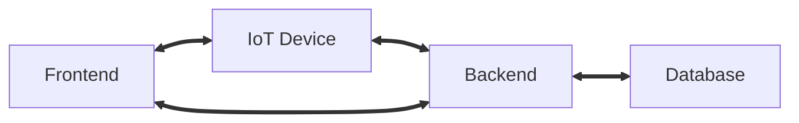

# 1. Introduction

This solution is educational. 
Its goal is to create a system that will allow users who have problems caring for their indoor plants, 
or those who, on the contrary, are very careful about it, to monitor the condition of their plants

## 1.1. Terms/Acronyms and Definitions

| Term/Acronym | Definition                      | Description |
| ------------ | ------------------------------- | ----------- |
| CVUD         | Create/View/Update/Delete       |             |
| IoT          | Internet of Things              |             |

# 2. System/Solution Overview

All projects included in the solution are built on the .NET framework, 
as this provides us with a unified development stack

## 2.1. System Diagram

## 2.2. System Actors

| User/Role | Frequency of Use              | Security/Access/Features |
| --------- | ----------------------------- | ------------------------ |
| Person    | CVUD plant. Push-notification | Login/Signup. CVUD plant |

# 3. Functional Specification

| № | Description             | Rules/Dependencies |
| - | ----------------------- | ------------------ |
| 1 | Signup/Login User       |                    |
| 2 | CVUD Plant              |                    |
| 3 | Configure sensors       |                    |
| 4 | Send push-notifications |                    |